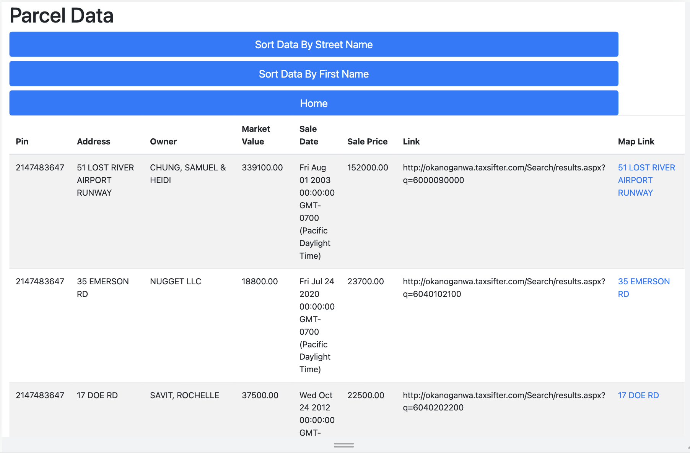
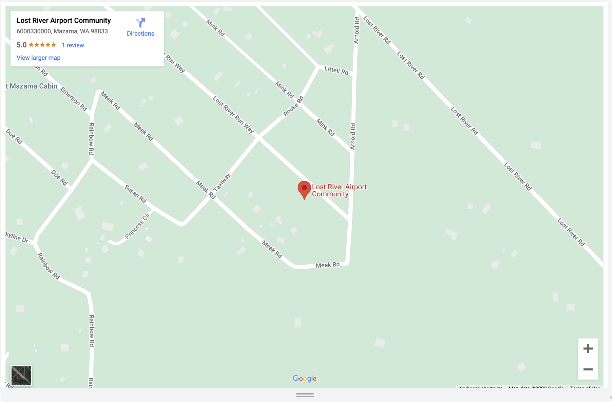

# Parcel Data Sorter

## Table of Contents
* [Description](#Description)
* [Installation](#installation)
* [Tech](#Tech)
* [Contributing](#contributing)
* [Tests](#tests)
* [Questions](#questions)

## Description 
This is a full-stack web application using a MVC paradigm that lets users sort and view data in a table format. The user can sort the data by street name or first name, and click on a link to view each address in Google Maps.

## Installation 
This application requires node.js. The user should fork the repository from GitHub and install all dependecies with npm i. To run, source the schema and run npm start and go to locahost:3000 in a browser. To view the database from MySQL, start the MySQL server by running the command `mysql -u <username> -p` and entering your password when prompted.

View a demonstration video [Screencastify](https://drive.google.com/file/d/1bxxJf_VcAajEm50h003KED-KlB7cOoV3/view) 

## Tech
HTML
Javascript
Handlebars
Node.js
Express.js
MySQL
Bootstrap
Google Maps API

## Contributing 
Contributors should read the installation section. 

## Tests
There are no tests for this application. 

## Questions
If you have any questions about this projects, please contact me directly at kelton.leach@gmail.com. You can view more of my projects at https://github.com/keltonlea.